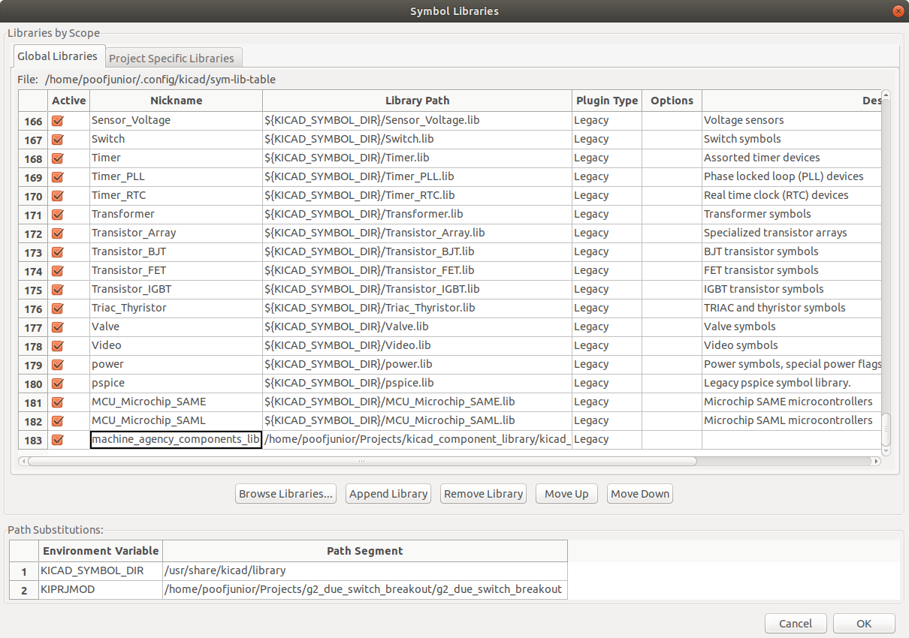
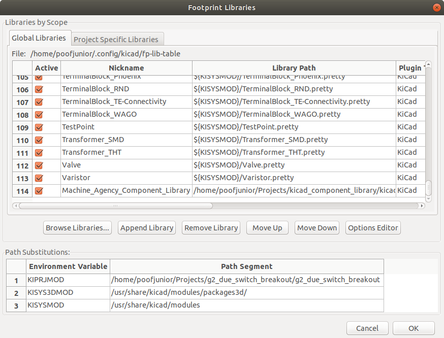

# Machine Agency Electronics Components Library

## Installation Instructions

1. Clone this repo anywhere on your file system.
1. In EESchema, append the absolute path of the .lib file into the **Symbol Librariy Table** (in Preferences --> Manage Symbol Libraries).

1. In CVPCB, set the absolute path of the .pretty directory into the **Footprint Library Table** (in Preferences --> Manage Footprint Libraries)

## Creating New Library Symbols

Check the [Reference Designator Listing](https://en.wikipedia.org/wiki/Reference_designator) to see what type of reference your new part should have.

## Footprint Bare Minimum Requirements:
* Place the footprint origin at the part's centroid.
